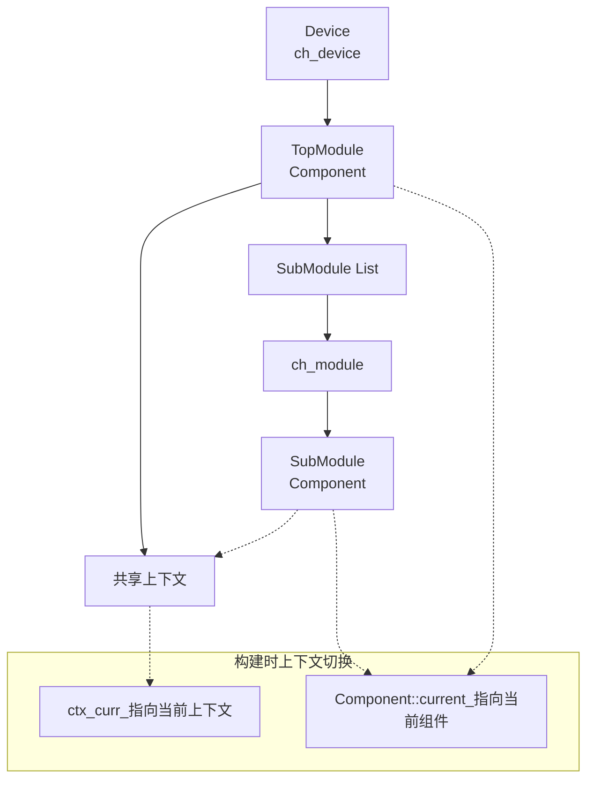

# ch_module构造函数对Component及Context关系梳理

## 1. 整体流程概述

`ch_module`的构造函数实现了模块实例化的核心逻辑，它需要正确处理：
1. **父子组件关系**：建立模块间的层次结构
2. **上下文继承**：子模块复用父模块的上下文环境
3. **作用域管理**：确保在正确的上下文中创建IR节点

## 2. 详细构造过程分析

### 2.1 ch_module构造函数实现

```cpp
template <typename T, typename... Args>
class ch_module {
public:
    explicit ch_module(const std::string& instance_name, Args&&... args) {
        // 1. 获取当前活动的父组件
        auto* parent_component = Component::current();
        
        // 2. 获取父组件的上下文
        auto* parent_context = parent_component->context();
        
        // 3. 构建层次化路径名
        std::string child_path_name = build_hierarchical_name(parent_component, instance_name);
        
        // 4. 创建子组件实例
        std::unique_ptr<T> local_child_ptr = std::make_unique<T>(parent_component, child_path_name);
        
        // 5. 在父上下文中构建子组件
        local_child_ptr->build(parent_context);
        
        // 6. 将子组件添加到父组件的子组件列表中
        child_component_ptr_ = dynamic_cast<T*>(parent_component->add_child(std::move(local_child_ptr)));
    }
};
```

### 2.2 关键步骤详解

#### 步骤1：获取当前活动父组件
```cpp
auto* parent_component = Component::current();
```
- 使用线程局部存储的`Component::current_`获取当前正在构建的组件
- 这是实现作用域嵌套的关键机制

#### 步骤2：获取父组件上下文
```cpp
auto* parent_context = parent_component->context();
```
- 子模块复用父模块的上下文环境
- 确保所有IR节点都在同一上下文中创建

#### 步骤3：构建层次化命名
```cpp
std::string child_path_name = build_hierarchical_name(parent_component, instance_name);
```
- 实现模块的层次化命名：`parent.child.grandchild`
- 便于调试和信号查找

#### 步骤4：创建子组件实例
```cpp
std::unique_ptr<T> local_child_ptr = std::make_unique<T>(parent_component, child_path_name);
```
- 调用子组件构造函数
- 建立父子组件关系

#### 步骤5：在父上下文中构建子组件
```cpp
local_child_ptr->build(parent_context);
```
- **关键**：传递`parent_context`参数
- 子组件的所有IR节点将在父上下文中创建
- 实现上下文的继承和共享

#### 步骤6：转移所有权
```cpp
child_component_ptr_ = dynamic_cast<T*>(parent_component->add_child(std::move(local_child_ptr)));
```
- 将子组件所有权转移给父组件
- 维护组件树的完整性

## 3. Component与Context的关系

### 3.1 层次关系
```
父组件 (Parent Component)
├── 父上下文 (Parent Context)
│   ├── 节点1
│   ├── 节点2
│   └── ...
└── 子组件列表
    ├── 子组件1 (Child Component 1)
    │   └── (共享父上下文)
    ├── 子组件2 (Child Component 2)
    │   └── (共享父上下文)
    └── ...
```

### 3.2 上下文共享机制
```cpp
// Component::build()方法中处理上下文
void Component::build(ch::core::context* external_ctx) {
    if (external_ctx) {
        // 使用外部上下文（子模块情况）
        target_ctx = external_ctx;
        // 在外部上下文中执行构建
        ch::core::ctx_curr_ = target_ctx;
        create_ports();
        describe();
    } else {
        // 创建自己的上下文（顶层模块情况）
        ctx_ = std::make_unique<ch::core::context>(name_, parent_ctx);
        target_ctx = ctx_.get();
        // 使用RAII管理上下文切换
        ch::core::ctx_swap ctx_guard(target_ctx);
        create_ports();
        describe();
    }
}
```

## 4. 完整的实例化流程示例

假设有以下层次结构：
```cpp
class TopModule : public Component {
    void describe() override {
        CH_MODULE(SubModule, sub1);  // 实例化子模块
    }
};

class SubModule : public Component {
    void describe() override {
        // 创建一些IR节点...
    }
};
```

### 4.1 实例化过程追踪

1. **创建TopModule设备**
   ```cpp
   ch::ch_device<TopModule> device;
   ```
   - 创建TopModule实例
   - TopModule::build()被调用（无external_ctx，创建自己的上下文）

2. **TopModule::describe()执行**
   ```cpp
   CH_MODULE(SubModule, sub1);
   ```
   - 展开为：`ch::ch_module<SubModule> sub1("sub1");`

3. **ch_module<SubModule>构造函数执行**
   - `parent_component = TopModule实例`（通过Component::current()）
   - `parent_context = TopModule的上下文`
   - 创建SubModule实例
   - 调用`SubModule::build(parent_context)`（注意：传递了父上下文）

4. **SubModule::build()执行**
   - 由于传递了`parent_context`，SubModule复用TopModule的上下文
   - 所有SubModule创建的IR节点都在TopModule的上下文中

5. **所有权转移**
   - SubModule实例的所有权从ch_module转移给TopModule
   - TopModule维护子组件列表

## 5. 关键设计要点

### 5.1 上下文继承
- **目的**：确保整个设计的IR节点都在统一的上下文中管理
- **实现**：通过`build(external_ctx)`参数传递父上下文
- **优势**：避免上下文碎片化，便于统一管理和优化

### 5.2 作用域管理
- **当前组件跟踪**：`Component::current()`维护当前活动组件
- **自动切换**：`ctx_swap` RAII机制确保上下文正确切换
- **层次化构建**：从顶层到底层逐级构建

### 5.3 内存管理
- **所有权链**：父组件拥有子组件
- **生命周期**：子组件生命周期不超过父组件
- **自动析构**：通过unique_ptr自动管理内存

## 6. 数据结构关系图



## 7. 调试信息示例

通过调试输出可以清楚看到关系建立过程：
```
[ch_module::ctor] Creating module for component SubModule
[ch_module::ctor] Using parent context 0x12345678
[ch_module::ctor] Using hierarchical name/path: 'top.sub1'
[Component::build] Using external context 0x12345678
```

这种设计确保了模块化HDL设计的正确性和高效性，同时保持了良好的封装性和可维护性。
