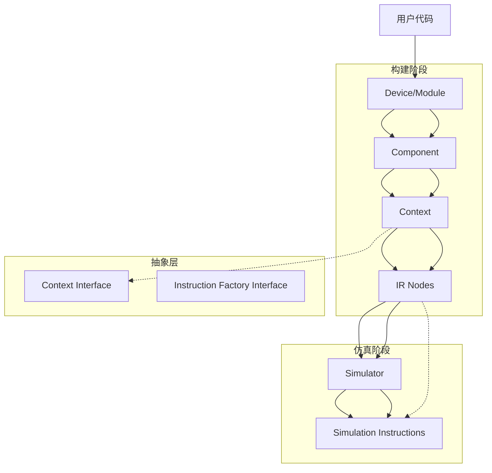

# CppHDL项目维护者内部文档 (Coding Internal Documentation)

这是一个硬件描述语言的 C++ 实现，包含了 IR（中间表示）、代码生成、仿真等功能。

主要组件包括：
IR 层：lnodeimpl 及其派生类表示硬件节点
上下文管理：context 管理节点创建和生命周期
代码生成：verilogwriter 将 IR 转换为 Verilog
仿真器：Simulator 执行硬件行为仿真
组件系统：Component 提供模块化设计

## 1. 项目架构概览

```
CppHDL/
├── include/                    # 头文件目录
│   ├── abstract/              # 抽象接口层
│   ├── core/                  # 核心IR和基础设施
│   ├── ast/                   # 仿真指令系统
│   ├── component.h           # 组件系统
│   ├── device.h              # 设备顶层封装
│   ├── module.h              # 模块实例化
│   ├── simulator.h           # 仿真器核心
│   └── macros.h              # 宏定义
└── src/                       # 源文件目录
    ├── core/                 # 核心实现
    ├── ast/                  # 仿真指令实现
    └── 其他模块实现...
```

## 2. 模块依赖关系图



## 3. 核心模块详解

### 3.1 Context系统 (上下文管理)

**文件**: `core/context.h`, `core/context.cpp`
**依赖**: `abstract/context_interface.h`, `core/lnodeimpl.h`

**作用**: 
- 管理整个设计的构建上下文
- 创建和管理IR节点
- 执行拓扑排序生成评估列表
- 提供线程安全的上下文切换

**关键方法**:
- `create_node<T>()`: 模板方法创建各种IR节点
- `get_eval_list()`: 获取拓扑排序后的节点列表
- `ctx_swap`: RAII上下文切换

### 3.2 IR节点系统 (中间表示)

**文件**: `core/lnodeimpl.h`, `ast/ast_nodes.h`, `core/lnodeimpl.cpp`
**依赖**: `ast/instr_base.h` (仅在cpp中)

**作用**:
- 定义所有IR节点的基类和具体实现
- 每个节点负责创建对应的仿真指令
- 维护节点间的连接关系(源节点管理)

**节点类型**:
- `litimpl`: 常量节点
- `inputimpl`: 输入节点
- `outputimpl`: 输出节点
- `regimpl`: 寄存器节点
- `opimpl`: 操作节点(算术、逻辑运算)
- `proxyimpl`: 代理节点(表达式优化)

**解耦设计**:
```cpp
// 在.h中只声明接口
virtual std::unique_ptr<ch::instr_base> create_instruction(
    ch::data_map_t& data_map) const;

// 在.cpp中实现具体逻辑
std::unique_ptr<ch::instr_base> regimpl::create_instruction(...) {
    return std::make_unique<ch::instr_reg>(id_, size_, next_node_id);
}
```

### 3.3 仿真指令系统

**文件**: `ast/instr_*.h`, `ast/instr_*.cpp`
**依赖**: `ast/instr_base.h`

**作用**:
- 执行仿真时的具体计算
- 按照拓扑顺序执行指令
- 更新数据缓冲区

**指令类型**:
- `instr_reg`: 寄存器更新指令
- `instr_op_*`: 各种运算指令
- `instr_proxy`: 代理拷贝指令
- `instr_input/output`: IO处理指令

**执行流程**:
```
Simulator::eval()
├── 遍历eval_list_(拓扑排序的节点)
├── 查找对应指令(instr_map_)
└── 调用指令的eval()方法
```

### 3.4 仿真器核心

**文件**: `simulator.h`, `src/simulator.cpp`
**依赖**: `core/context.h`, `core/lnodeimpl.h`, `ast/instr_base.h`

**作用**:
- 将IR转换为仿真指令
- 管理仿真数据缓冲区
- 执行仿真步骤

**初始化过程**:
1. 获取拓扑排序的节点列表
2. 为每个节点分配数据缓冲区
3. 让每个节点创建对应的仿真指令

**执行过程**:
1. 按拓扑顺序执行所有指令
2. 更新数据缓冲区
3. 完成一个仿真周期

### 3.5 组件系统

**文件**: `component.h`, `component.cpp`
**依赖**: `core/context.h`

**作用**:
- 所有模块的基类
- 管理模块间的层次关系
- 控制构建流程

**关键流程**:
```
Component::build()
├── 设置当前上下文
├── 调用create_ports()创建端口
├── 调用describe()描述行为
└── 恢复原上下文
```

### 3.6 抽象接口层

**文件**: `abstract/context_interface.h`
**依赖**: 无具体实现依赖

**作用**:
- 提供上下文的抽象接口
- 实现依赖倒置，降低模块耦合

## 4. 构建与仿真流程

### 4.1 构建阶段 (Build Phase)

```cpp
// 1. 创建设备
ch::ch_device<MyModule> device;
    └── 创建顶层模块实例
        └── Component::build()
            ├── 创建Context
            ├── 设置当前上下文
            ├── create_ports() - 创建IO端口
            └── describe() - 描述模块行为
                ├── 创建各种IR节点
                ├── 建立节点间连接
                └── Context管理所有节点

// 2. Context执行拓扑排序
Context::get_eval_list()
```

### 4.2 仿真阶段 (Simulation Phase)

```cpp
// 1. 创建仿真器
ch::Simulator simulator(device.context());
    ├── initialize()
    │   ├── 获取eval_list_(拓扑排序)
    │   ├── 为每个节点分配数据缓冲区
    │   └── 让每个节点创建指令(create_instruction)
    │       ├── regimpl -> instr_reg
    │       ├── opimpl -> instr_op_*
    │       └── ...
    └── ...

// 2. 执行仿真
simulator.tick()
    └── simulator.eval()
        └── 按拓扑顺序执行指令
            ├── instr_reg::eval() - 更新寄存器
            ├── instr_op_*::eval() - 执行运算
            ├── instr_proxy::eval() - 拷贝数据
            └── ...
```

## 5. 解耦设计要点

### 5.1 节点自创建指令模式

**设计思想**: 每个IR节点最了解自己的结构，由节点自己负责创建对应的仿真指令。

**实现方式**:
```cpp
// lnodeimpl.h - 基类声明接口
class lnodeimpl {
    virtual std::unique_ptr<ch::instr_base> create_instruction(
        ch::data_map_t& data_map) const;
};

// ast_nodes.cpp - 具体节点实现
std::unique_ptr<ch::instr_base> regimpl::create_instruction(...) {
    return std::make_unique<ch::instr_reg>(id_, size_, next_node_id);
}
```

**优势**:
- 单一职责: 每个节点只负责自己的指令创建
- 易于扩展: 添加新节点类型不需要修改Simulator
- 降低耦合: Simulator不需要知道具体有哪些指令类型

### 5.2 抽象接口解耦

**Context抽象化**:
```cpp
class context : public abstract::context_interface {
    // 实现抽象接口方法
};
```

## 6. 关键数据结构

### 6.1 数据缓冲区映射
```cpp
using data_map_t = std::unordered_map<uint32_t, sdata_type>;
// key: 节点ID, value: 仿真数据
```

### 6.2 指令映射
```cpp
std::unordered_map<uint32_t, std::unique_ptr<ch::instr_base>> instr_map_;
// key: 节点ID, value: 对应的仿真指令
```

### 6.3 评估列表
```cpp
std::vector<ch::core::lnodeimpl*> eval_list_;
// 拓扑排序后的节点列表，确保依赖关系正确
```

## 7. 扩展指南

### 7.1 添加新的IR节点类型

1. 在`ast/ast_nodes.h`中声明新节点类
2. 在`src/core/ast_nodes.cpp`中实现`create_instruction`方法
3. 在仿真指令系统中添加对应的指令类(如果需要)

### 7.2 添加新的运算指令

1. 在`ast/instr_op.h`中声明新指令类
2. 在`ast/instr_op.cpp`中实现`eval`方法
3. 在对应的IR节点`create_instruction`中添加创建逻辑

### 7.3 修改上下文行为

1. 实现`abstract::context_interface`创建新的上下文类
2. 修改`Component`使用新的上下文实现

## 8. 性能考虑

### 8.1 内存管理
- 使用`std::unique_ptr`自动管理内存
- 节点和指令对象在构建阶段创建，仿真阶段重用

### 8.2 执行效率
- 拓扑排序确保依赖关系正确
- 按顺序执行避免重复计算
- 数据缓冲区预分配避免运行时内存分配

## 9. 调试支持

### 9.1 调试输出
- 详细的构建和仿真过程日志
- 节点创建和指令执行的跟踪信息

### 9.2 调试开关
```cpp
extern bool debug_context_lifetime;  // 控制上下文调试输出
```

这个文档为维护者提供了清晰的代码结构理解，便于快速定位问题和进行功能扩展。
